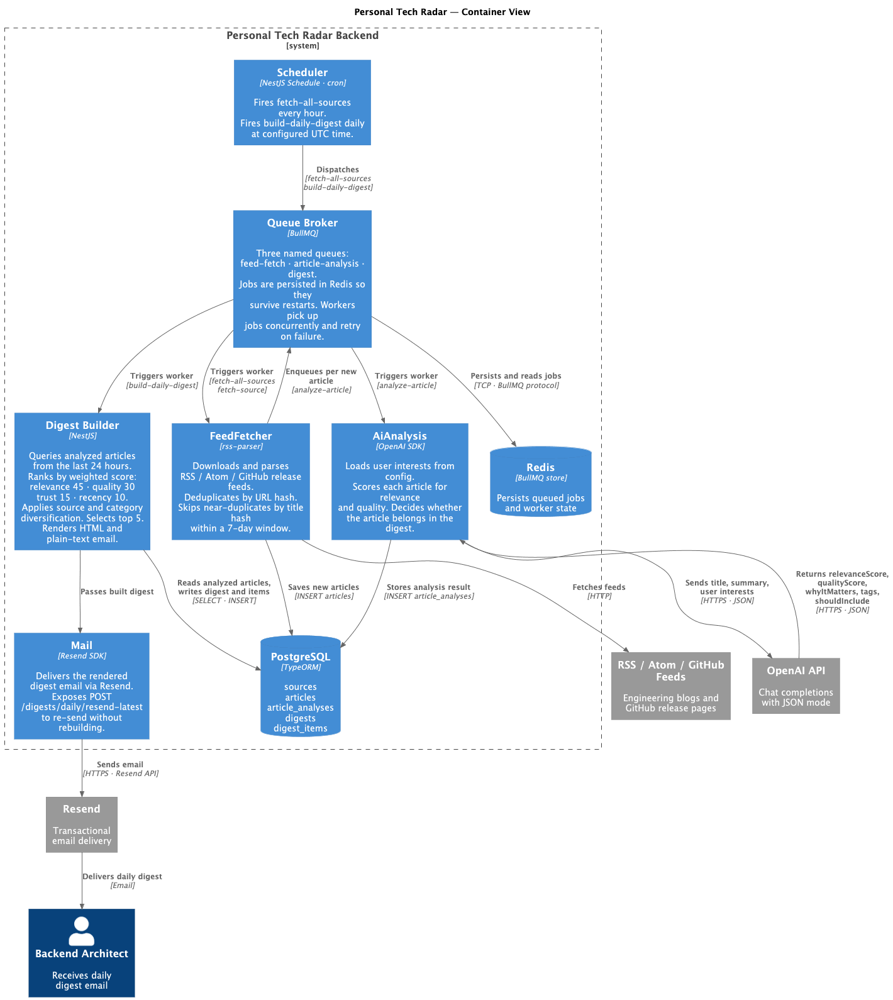
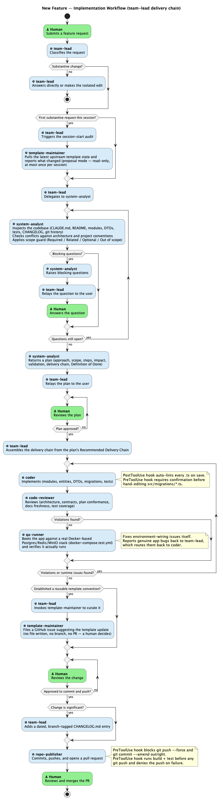

# Personal Tech Radar — Backend

A NestJS service that automatically curates a daily engineering digest. It fetches articles from RSS/Atom feeds and GitHub release pages, runs a two-stage AI analysis pipeline optimised for token usage, and delivers a clean email digest via Resend.



**How it works:**

1. A cron job fires every hour and dispatches a `fetch-all-sources` BullMQ job.
2. The feed fetcher downloads each enabled source, parses RSS/Atom/GitHub releases, and saves all new articles to PostgreSQL. Duplicates are detected by URL hash; near-duplicates by title hash within 7 days. Articles older than 78 hours are stored but not queued for analysis.
3. Each fresh article (≤ 78 h old, not a duplicate) triggers an `analyze-article` job. Analysis is global (no per-user dimension) and runs in two stages against a single `ArticleAnalysis` row per article:
   - **Pre-screen (Stage 1)** — a lightweight OpenAI call using only the article title and feed description. Returns `preScreenIsRelevant` + `preScreenReason`. This stage acts as a cheap relevance gate and avoids spending tokens on full analysis for clearly irrelevant content.
   - **Full analysis (Stage 2)** — runs only when `preScreenIsRelevant = true`. Calls OpenAI with the full article context, produces `relevanceScore`, `qualityScore`, scoring flags, taxonomy signals, and a digest summary, and stamps `fullAnalysisAt`. Full analysis is skipped (idempotent resume) if it already ran for the article.
4. A second cron job fires daily (default 07:00 UTC) and dispatches `build-daily-digest`. The digest builder selects only fully-analyzed, pre-screen-relevant articles (`ArticleAnalysis.preScreenIsRelevant = true` and `fullAnalysisAt IS NOT NULL`) and attempts to find at least `DAILY_DIGEST_ARTICLES_LIMIT` (default 3) using a time-window fallback: 24 h → 48 h → 72 h. Articles already included in any previously built or sent digest are excluded. Ranking: relevance × 0.45 + quality × 0.30 + source trust × 0.15 + recency × 0.10. Source/category diversification is applied and up to `DAILY_DIGEST_ARTICLES_LIMIT` items are selected. Build metadata is stored in `buildDebug`.
5. The digest is saved as a draft, then the email is rendered and sent through Resend. The digest status is updated to `sent`.
6. At any time, `POST /digests/daily/resend-latest` re-sends the most recently built digest without rebuilding it.

---

## Tech Stack

| Layer | Technology |
|---|---|
| Framework | NestJS 11 (Express) |
| Language | TypeScript 5.7 |
| Database | PostgreSQL + TypeORM 0.3 |
| Cache / Queues | Redis + BullMQ |
| AI Analysis | OpenAI API |
| Email | Resend SDK |
| Feed Parsing | rss-parser |
| Scheduler | @nestjs/schedule |
| Validation | class-validator + class-transformer |
| Documentation | Swagger / OpenAPI (`/docs`) |
| Auth | API key guard (`X-API-KEY` header) for admin endpoints; JWT (access + persisted/hashed refresh tokens) for human users via `AuthModule` |

---

## Project Structure

```
src/
├── common/
│   ├── database/          # TypeORM module + DataSource for migrations
│   ├── redis/             # Global RedisService
│   ├── s3/                # Global S3StorageService
│   ├── http/              # HttpService — fetch wrapper with retry/backoff
│   ├── error/             # Global exception filter + ErrorResponseDto
│   ├── logging/           # LoggingService (thin NestJS Logger wrapper)
│   ├── guards/            # ApiKeyGuard
│   └── dto/               # PaginatedResponseDto
├── config/
│   └── user-interests.yaml  # AI analysis interest profile
├── auth/                  # Register/login/refresh/logout, email verification, password reset
├── users/                 # User entity + profile/onboarding endpoints (GET/PATCH/DELETE /users/me, POST /users/me/onboarding, GET /users/me/taxonomy)
├── taxonomy/              # TechnologyInterest/ContentStream taxonomy, dedup resolver, merge endpoint
├── sources/               # Source CRUD — RSS/Atom/GitHub feeds + web source discovery/extraction
├── articles/              # Article storage and querying
├── user-actions/          # SavedArticle + PersonalArticleLink — real per-user save/redirect/open-tracking
├── feed/                  # Personal Feed API — day-grouped, scored, capped/distributed feed + Redis cache
├── public-feed/           # Public, unauthenticated feed listing + taxonomy-based preview scoring
├── feed-fetcher/          # Fetches and parses feeds, creates articles
├── ai-analysis/           # OpenAI article analysis, ArticleAnalysis entity
├── digest/                # Digest building, scoring, email body generation
├── mail/                  # Resend email delivery
├── queue/                 # BullMQ setup and QueueService
├── scheduler/             # Cron jobs: fetch hourly, digest daily
├── health/                # GET /health
├── seeds/                 # Manifest sync CLI (config/sources.manifest.json -> Source/SourceCandidate)
└── migrations/            # TypeORM migration files
```

---

## Domain Modules

### AuthModule + UsersModule
Multi-tenant account infrastructure. `User` (`src/users/entities/user.entity.ts`) holds `email`/`passwordHash`/`displayName`/`timezone`/`role` (`user` | `admin`) plus profile fields (`githubUrl`, `level`, digest opt-ins, `emailVerifiedAt`) and an `onboardingCompletedAt` column. `UserCommandService`/`UserQueryService` follow this repo's command/query split.

**Auth flow** (`POST`/`GET /auth/*`, `AuthController`):
1. `POST /auth/register` — creates the user immediately (email/password/displayName/timezone all required), persists an `EmailVerificationToken`, and sends a verification email via `MailService` — best-effort, matching the existing digest-send non-fatal-failure pattern (registration succeeds even if the email fails to send).
2. `GET /auth/verify-email?token=` — consumes the token and sets `emailVerifiedAt`. Does not mark onboarding complete.
3. `POST /auth/login` — email + password (validated via Passport `LocalStrategy` + `bcrypt.compare`), returns a short-lived JWT access token and a persisted, hashed, revocable refresh token (`RefreshToken` entity) — not a stateless JWT-only refresh.
4. `POST /auth/refresh` — rotates the refresh token: the presented token is looked up by its SHA-256 hash, revoked, and a new access/refresh pair is issued. `JwtStrategy.validate()` rejects a token whose user has been soft-deleted (relies on TypeORM's default `deletedAt IS NULL` exclusion).
5. `POST /auth/logout` — revokes the presented refresh token (idempotent).
6. `POST /auth/password/forgot` / `POST /auth/password/reset` — `PasswordResetToken` issuance and consumption; a successful reset also revokes every other active refresh token for that user. `PATCH /auth/password` changes the password while logged in (current password required, JWT-protected).

**Guards** (`src/auth/guards/`): `JwtAuthGuard` (JWT only), `HybridAuthGuard` (accepts either `X-API-KEY` — reusing `ApiKeyGuard`'s validation, and synthesizing an admin `request.user` principal (`role: UserRole.ADMIN`) when the key matches — or a JWT, for routes meant to serve both machine and human callers), `RolesGuard` + `@Roles(...)` decorator (role-gated routes), `@CurrentUser()` decorator (reads `request.user`).

**MVP3 Phase 8a — Admin API guard migration.** `HybridAuthGuard` + `RolesGuard` + `@Roles(UserRole.ADMIN)` now also protect:
- `SourcesController` (whole controller, `GET`/`POST`/`PATCH`/`DELETE /sources`, `GET`/`POST /source-candidates`)
- `DigestController` (`POST /digests/trigger`)
- `ArticlesController.addFeedback` only (`POST /articles/:id/feedback`) — `findAll`/`findOne` on that controller (`GET /articles`, `GET /articles/:id`) intentionally stay on `ApiKeyGuard` alone, unchanged

Because `HybridAuthGuard` synthesizes an admin principal for a valid `X-API-KEY`, **existing `X-API-KEY`-only ops/automation callers keep working unchanged** against all four migrated routes — no client-side change required. The only new capability is that an admin JWT can now be used in place of the API key on these routes.

**Profile endpoints** (`UsersController`, JWT-protected): `GET /users/me`, `PATCH /users/me` (displayName/timezone/githubUrl/level — role and verification/onboarding-completion state are not user-editable), `DELETE /users/me` (soft delete).

**Onboarding endpoints** (`UsersController` + `OnboardingService`, JWT-protected):
- `POST /users/me/onboarding` — body `{ level, technologyInterests: [{ kind, name }], contentStreamIds: [] }`. Each `technologyInterests` entry is resolved against the taxonomy via `TechnologyInterestCommandService.createOrReuse` (see TaxonomyModule below) and linked to the user; each `contentStreamIds` entry must reference an existing, enabled `ContentStream` or the whole request is rejected with `BadRequestException` before anything is linked. `user.level` is always updated; `user.onboardingCompletedAt` is set only if it was previously `null` — **safely re-callable**: calling it again after completion updates the level/selections but never un-sets the completion timestamp, so it doubles as "change my selections later" with no separate endpoint. Deliberately not wrapped in a single DB transaction: selections are persisted before the level/completion flag, so a mid-way failure leaves the user safely "not yet onboarded" and retryable. **Known limitation — additive-only:** re-submitting adds new technology/interest/content-stream selections but does not remove previously selected ones. Intentionally deferred since no consumer (Personal Feed, digest delivery) currently depends on removal semantics; revisit once Personal Feed or a dedicated subscription-management endpoint needs to support removing a selection.
- `GET /users/me/taxonomy` — returns `{ level, technologyInterests, contentStreams, onboardingCompletedAt }` for the current user.

**Admin Users endpoints** (`AdminUsersController`, `HybridAuthGuard` + `RolesGuard` + `@Roles(UserRole.ADMIN)`, MVP3 Phase 8a):
- `GET /admin/users?page=&limit=&email=&role=&includeDeleted=` — paginated list; `email` is a case-insensitive partial (`ILIKE`) match, `role` an exact match, `includeDeleted` (default `false`) opts soft-deleted users back into the results.
- `GET /admin/users/:id` — single user by id.
- `DELETE /admin/users/:id` — soft-delete any user by id (reuses `UserCommandService.softDelete`, not restricted to "self" the way `DELETE /users/me` is).

### TaxonomyModule
Personalization taxonomy, separate from `Source.category` (which classifies where content comes from, not what a user is interested in). Four entities: `TechnologyInterest` (`kind: 'technology' | 'interest'`, deduplicated by a resolver — see below), `ContentStream` (a fixed, curated set of 5 rows seeded by the `CreateTaxonomyTables` migration — never created/updated/deleted via the API in this phase), and their join tables `UserTechnologyInterest`/`UserContentStream`.

**Deduplication pipeline** (`TechnologyInterestResolverService.resolve(kind, rawName)`), run for every onboarding selection:
1. Normalize the input (`normalizeTechnologyInterestName` — lowercase/trim/collapse whitespace, but `.`/`#`/`+` are preserved since they're meaningful to a name's identity: "Node.js", "C#", ".NET").
2. Exact `normalizedName` match on `(kind, normalizedName)`.
3. Alias match — `aliases jsonb` containment (`@>`).
4. Similarity match via Postgres `pg_trgm`'s `similarity()`, gated by `TAXONOMY_SIMILARITY_THRESHOLD` (default `0.6`), using a GIN trigram index on `normalizedName`. A match here gets the input string appended to its `aliases` if not already present.
5. Otherwise, a new `TechnologyInterest` row is created.

`TechnologyInterestCommandService.createOrReuse(userId, kind, name)` wraps the resolver: links the resolved/created row to the calling user (upsert-ignore — never errors if already linked), and — only when a genuinely new row was created — enqueues a job on the isolated `taxonomy-source-discovery` queue (see QueueModule below).

`TechnologyInterestResolverService.resolveExisting(kind, rawName)` and `ContentStreamQueryService.findByKey(key)` are read-only lookups (exact + alias match only for the former, no similarity search, no create-on-miss) consumed by `AiAnalysisModule`'s Stage 2 full analysis to resolve an article's LLM-suggested technology/interest/stream signals against the existing catalog — an article's analysis output must never grow the taxonomy, so only `resolve()` (called exclusively from onboarding) ever creates a new `TechnologyInterest` row.

**Endpoints:**
- `GET /technology-interests?kind=&q=&page=&limit=` — paginated typeahead search, `JwtAuthGuard`.
- `GET /content-streams` — the 5 enabled streams, `JwtAuthGuard`.
- `POST /technology-interests/merge` — body `{ winnerId, loserId }`. Guards: `HybridAuthGuard` + `RolesGuard` + `@Roles('admin')` — the first route in the codebase to combine these (a low-blast-radius proof of the pattern ahead of a later, broader Admin API migration off `ApiKeyGuard`). `TechnologyInterestCommandService.merge` runs inside a single `dataSource.transaction()`: every `UserTechnologyInterest` row pointing at the loser is checked against the winner first — if the user already has both selected, the loser's join row is deleted instead of reassigned (avoiding a mid-transaction unique-constraint violation, which would otherwise abort the whole Postgres transaction and fail even the delete-fallback); otherwise it's reassigned to the winner. The loser is then soft-deleted with `mergedIntoId` set to the winner — technologies/interests are edited or merged, never hard-deleted.

### SourcesModule
Manages feed sources. Admin-only endpoints, protected by `HybridAuthGuard` + `RolesGuard` + `@Roles(UserRole.ADMIN)` (`X-API-KEY` still works unchanged — see the guard-migration note under AuthModule/UsersModule above; previously plain `ApiKeyGuard`). When a source is created (via `POST /sources` or `npm run seed:sources:sync`), the URL is validated: for `rss`/`atom`/`github_release` sources the feed must return HTTP 200, parse as valid RSS/Atom, and contain at least one item; for `web` sources, a deterministic discovery pass (below) must find at least one working entry point before the source and its `WebSourceConfig` are saved. Sources that fail validation are rejected without being saved.

- `GET /sources?page=&limit=&type=&category=&enabled=&includeDeleted=` — **MVP3 Phase 8a breaking change:** now returns `{ data: SourceResponseDto[], meta: { total, page, limit, totalPages } }` instead of a bare array. Filterable by `type`, `category`, `enabled`; `includeDeleted` (default `false`) opts soft-deleted sources back into the results. The only known consumer, `npm run seed:sources:sync`, calls `SourcesService`/`SourceSyncService` directly in-process and never through HTTP, so it is unaffected by this change.
- `POST /sources` — add a source (validates feed URL, or runs web discovery, before saving)
- `PATCH /sources/:id` — update a source
- `DELETE /sources/:id` — soft-delete (sets `deletedAt`)

Source categories: `backend_architecture_infra`, `engineering_deep_dives`, `node_typescript_nestjs`, `ai_engineering`

Source types: `rss`, `atom`, `github_release`, `web`.

#### Web source discovery (`SourceDiscoveryService`)
For `type: 'web'` sources, entry points and article links are found via a deterministic fallback chain, now with a bounded headless-browser step and an opt-in AI structural fallback as the last two resorts:

1. **robots.txt** — fetch `/robots.txt` and parse `Sitemap:` directives.
2. **Common sitemap paths** — `/sitemap.xml`, `/sitemap_index.xml`, `/wp-sitemap.xml`, parsed with `fast-xml-parser` (handles both a sitemap index and a plain `urlset`, recursing one level into nested sitemaps). Candidate URLs are filtered with simple heuristics (date-like segments, multi-word slug-like segments) and a denylist of known non-article paths — both generic CMS/blog-engine junk (`/tag/`, `/category/`, `/page/`, etc.) and common non-blog site sections (`/careers/`, `/products/`, `/services/`, etc.) — and bounded to 20.
3. **RSS/Atom** — checks `<link rel="alternate" type="application/rss+xml|atom+xml">` in the page HTML plus common paths (`/feed`, `/rss`, `/atom.xml`), validated through the *same* `fetchAndValidateFeed` helper (`src/common/util/feed-validator.util.ts`) used by `SourcesService.create` for `rss`/`atom` sources — no duplicated fetch/parse logic.
4. **Cheerio entry-page link discovery** — fetches the configured entry URL(s), strips nav/header/footer/aside, groups remaining links by their nearest parent selector, and picks the largest qualifying group as the article-listing container.
5. **Playwright-rendered link discovery** (`PlaywrightFetchService`) — for listing pages whose article links only appear after JavaScript runs. Launches a bounded, plain headless Chromium context (no stealth/evasion, no header spoofing — see the constraint below), renders the same entry URL(s), and runs the *same* link-grouping logic as step 4 against the rendered DOM. Gated by `PLAYWRIGHT_ENABLED` (default `false`); bounded by `PLAYWRIGHT_TIMEOUT_MS` as a hard navigation timeout.
6. **OpenAI structural fallback** (`SourceStructureAiService`) — only reached once steps 1–5 have all failed. Assembles a small, bounded snapshot of the entry page (title, headings, feed links found, sitemap URLs found even if filtered out, JSON-LD fragments, a few HTML fragments, candidate links + anchor text, and why the chain failed — never full page content), asks OpenAI for a suggested method (`cheerio` or `playwright`) and selector, and **re-runs that suggestion through the real deterministic/Playwright discovery path before treating it as usable**. A suggestion that doesn't survive re-validation is discarded, never persisted. Gated by `SOURCE_DISCOVERY_AI_FALLBACK_ENABLED` (default `false`) and capped by `SOURCE_DISCOVERY_AI_FALLBACK_MAX_PER_DAY` (default `10`) via a Redis-backed daily counter.

**Playwright product/legal constraint:** `PlaywrightFetchService` must never be used to bypass robots.txt directives, paywalls, auth walls, or anti-bot measures. It renders exactly what a plain headless Chromium instance would see — no stealth plugins, no fingerprint evasion, no injected cookies/sessions. If a site blocks a plain headless browser, that's the correct, intended outcome.

**Where Playwright runs:** source creation/validation (`POST /sources`) runs it inline, synchronously, bounded by `PLAYWRIGHT_TIMEOUT_MS` — a one-off, low-frequency admin action. The hourly re-fetch cycle (`WebSourceFetcherService`, driven by `FeedFetcherService.fetchSource`) never runs it inline: when the deterministic chain is exhausted for an existing source, it enqueues a job onto the isolated `web-source-browser-fetch` queue instead (see QueueModule below), so a slow/hung site can never stall the rest of that cycle. `PlaywrightFetchProcessor` performs the actual browser fetch there and feeds the result back into the same ingestion path (dedup, publish-date priority, self-healing) that `WebSourceFetcherService.fetchSource` already uses.

Each step returns a normalized `DiscoveryResult` (method, entry URLs, confidence, and — for the Cheerio/Playwright steps — the inferred `articleLinkSelector`).

Content extraction (`ContentExtractionService`) uses its own ladder per article: JSON-LD (`Article`/`BlogPosting`) → OpenGraph meta tags → Readability+JSDOM → an optionally configured `articleContentSelector`.

#### Source candidates + promotion (`SourceCandidatesService`)
A `SourceCandidate` (`source_candidates` table) is a not-yet-vetted URL — created via `SourceCandidatesService.create(url, ...)`, which upserts by `normalizedUrl` (idempotent: re-discovering the same URL refreshes the existing row's `proposedConfig`/`lastValidatedAt` instead of duplicating it). Nothing currently calls `create` over HTTP; it exists for the seed-manifest sync flow to call directly.

- `GET /source-candidates` — paginated list, filterable by `status` (`pending`, `validated`, `rejected`, `promoted`, `needs_review`). Same admin guard as the rest of `SourceCandidatesController` (`HybridAuthGuard` + `RolesGuard` + `@Roles(UserRole.ADMIN)`, previously plain `ApiKeyGuard`).
- `POST /source-candidates/:id/promote` — runs discovery + sampled pre-analysis and promotes if enough samples are relevant
- `POST /source-candidates/:id/reject` — manual rejection with an optional `reason`

`SourceCandidatesService.promote(id)`:
1. Runs the same `SourceDiscoveryService` fallback chain (sitemap → RSS/Atom → Cheerio → Playwright) against the candidate's `normalizedUrl`. Outright discovery failure marks the candidate `rejected` with the failure reason — no `Source` row is ever created.
2. On success, creates a **provisional** `Source` with `enabled: false` (so the normal fetch cycle's `findAllEnabled` never picks it up mid-evaluation). When `detectedType` is `rss`/`atom` and discovery captured the actual working feed URL, a genuine `rss`/`atom` `Source` is created (no `WebSourceConfig`) — the same lean shape a real feed source would get. Otherwise (web-detected, or a feed URL wasn't captured) it creates `type: 'web'` plus a `WebSourceConfig` recipe, seeded with the candidate's own URL as the entry point (not discovery's output — using discovered article permalinks as the recurring crawl seed would break future re-discovery cycles). `SourceCandidate.detectedType` always records the real underlying mechanism as metadata regardless of which path was taken.
3. Samples up to 5 of the entry URLs discovery already found (no separate crawl), fetches and extracts each via `ContentExtractionService`, and creates a minimal `Article` row per sample tied to the provisional source.
4. Runs **pre-analysis only** (`AiAnalysisService.preAnalyzeArticle`) on each sampled article — never full analysis, preserving the token-economy pattern above.
5. If ≥ 2 sampled articles come back `preScreenIsRelevant`, the provisional `Source` is flipped to `enabled: true` and the candidate is marked `promoted`. Otherwise the provisional `Source` is deleted (`ON DELETE CASCADE` removes its `WebSourceConfig` and sample `Article` rows with it) and the candidate is marked `needs_review` with a `validationError` explaining the relevant/sampled count — a candidate is never silently discarded.

A candidate's `proposedConfig` (jsonb) can carry a `name`/`category` hint for the eventual `Source`; absent that, the domain is used as the name and a generic default category is applied.

`WebSourceFetcherService` (in `FeedFetcherModule`) tries the source's stored `preferredDiscoveryMethod`/`preferredExtractionMethod` first; if that recipe no longer works, it walks the full fallback chain and — if a different method succeeds — persists the new method back onto `WebSourceConfig` along with `lastValidatedAt` (self-healing). Ingested web articles go through the same `urlHash`/`titleHash` dedup path as RSS articles. No raw HTML is archived; only extracted text and extraction metadata are stored on the `Article` row, so extraction is simply re-run from the network if needed.

**Publish-date extraction:** `Article.publishedAt` for web-ingested articles is resolved in priority order — sitemap `<lastmod>` (captured during discovery) → `datePublished`/`dateCreated` from JSON-LD → OpenGraph `article:published_time` → ingestion time as a last resort. Perfect extraction isn't guaranteed for every site (a page with no structured data and a sitemap with no `<lastmod>` falls all the way through to "just discovered = just published"), but this makes the fallback the rare case rather than the default, which matters for the 24h/48h/72h digest window fallback and the 78h analysis staleness gate — both of which previously treated every web article as maximally fresh.

### ArticlesModule
Stores articles fetched from sources.

- `GET /articles` — paginated list (filter by `status`, `sourceId`). `ApiKeyGuard` only, unchanged (moved from class-level to method-level in MVP3 Phase 8a — no behavior change).
- `GET /articles/:id` — single article. `ApiKeyGuard` only, unchanged (same method-level move as above).
- `POST /articles/:id/feedback` — submit `useful` / `not_useful` feedback; upserts the user's per-source `UserSourcePreference` row. **MVP3 Phase 8a:** now `HybridAuthGuard` + `RolesGuard` + `@Roles(UserRole.ADMIN)` (previously `ApiKeyGuard`) — `X-API-KEY` still works unchanged (see the guard-migration note under AuthModule/UsersModule above).
- `GET /articles/:id/feedback/click?type=useful|not_useful&token=TOKEN` — unguarded endpoint for email digest links; saves feedback and updates the same per-source preference

**Admin Articles endpoints** (`AdminArticlesController`, `/admin/articles`, `HybridAuthGuard` + `RolesGuard` + `@Roles(UserRole.ADMIN)`, MVP3 Phase 8a):
- `GET /admin/articles` — same pagination/filtering as `GET /articles` (`ArticlesService.findAll`/`ArticleListQueryDto`, reused as-is), behind the admin guard instead of `ApiKeyGuard`.
- `GET /admin/articles/:id` — single article (`ArticlesService.findOne`, reused as-is).
- `DELETE /admin/articles/:id` — soft-delete an article (`ArticlesService.remove`, new in this phase — sets `Article.deletedAt` via `softDelete`, does not trigger `ArticleAnalysis`'s `onDelete: CASCADE`, which only fires on a hard delete).

Feedback no longer touches `Source.trustScore`. Each `useful`/`not_useful` vote updates a `UserSourcePreference` row (`usefulCount`, `notUsefulCount`, `feedbackAdjustment`) for that `(userId, sourceId)` pair — `feedbackAdjustment` is a dampened score in the range ±8 that feeds into digest ranking (see DigestModule below). Feedback is single-user (`DEFAULT_USER_ID = 'default_user'`). The `article_feedbacks` table has a `userId` column and a `(articleId, userId)` unique constraint, so the schema is ready for multi-user when needed — the feedback and preference logic will need to be updated to aggregate per-user at that point.

Statuses: `new` → `pending_analysis` → `analyzed` | `duplicate` | `rejected` | `failed`

Articles are always stored on ingest. The 78 h analysis gate operates at queue time (in `FeedFetcherService`), not at storage time — old articles remain in the database with status `new`.

### FeedFetcherModule
Fetches RSS/Atom/GitHub release feeds using `rss-parser`. Deduplicates by `urlHash` (SHA-256 of URL). Articles with a matching `titleHash` from the last 7 days are saved as `duplicate`. New articles are dispatched to the `article-analysis` queue automatically.

`FeedFetcherService.fetchSource` branches on `source.type`: `web` sources are delegated entirely to `WebSourceFetcherService` (see SourcesModule above for the discovery/extraction chain); every other type keeps the original `rss-parser` path unchanged. Both paths run on the same `feed-fetch` cadence/queue — except the Playwright browser-fetch fallback, which runs on its own isolated `web-source-browser-fetch` queue (see QueueModule below) so a slow/hung site can never stall the rest of the hourly cycle. Article URLs are normalized (UTM/tracking params and fragments stripped, hostname lowercased, trailing slash removed — `src/common/util/url-normalize.util.ts`) before hashing/dedup.

### AiAnalysisModule
Fully global, two-stage pipeline against a single `ArticleAnalysis` row per article — no per-user dimension (the old per-user `ArticleRelevance` pre-screen gate was removed; `article_relevances` no longer exists). The row is created at Stage 1 and completed in place by Stage 2; `fullAnalysisAt` is the single source of truth for "has Stage 2 run".

**Stage 1 — Pre-screen** (`ArticleAnalysis.preScreenIsRelevant`/`preScreenReason`/`preScreenAt`):
- Input: article title + feed description only (no full content, no URL)
- Output: `preScreenIsRelevant` (boolean) + `preScreenReason` (one sentence)
- Prompt: `src/ai-analysis/instructions/pre-analyze-article.txt`
- Creates the `ArticleAnalysis` row if none exists yet. If `false`: article marked `ANALYZED`, pipeline stops.
- `AiAnalysisService.preAnalyzeArticle(articleId)` runs this stage in isolation (used by `SourceCandidatesService` to sample candidate articles without spending full-analysis tokens) and is idempotent — returns the existing row if one is already there.

**Stage 2 — Full analysis** (fills in the same `ArticleAnalysis` row, stamps `fullAnalysisAt`):
- Runs only when `preScreenIsRelevant = true` and `fullAnalysisAt` is still null (idempotent — a row that already completed Stage 2 is never recomputed)
- Input: title, URL, author, feed summary
- Prompt: `src/ai-analysis/instructions/analyze-article.txt`
- Output fields on `ArticleAnalysis`: `shortSummary`, `whyItMatters`, `practicalValue`, `tags`, `relevanceScore`, `qualityScore`, `finalScore`, `deepDiveScore`, `complexityLevel` (`beginner`/`intermediate`/`advanced`/`architect`), `materialType` (`article`/`tutorial`/`release_notes`/`announcement`/`opinion`/`case_study`/`reference`), `urgencyScore`, `evergreen`, `breakingChanges`, `releaseData`/`securityData` (loose JSONB, only populated when relevant), `mainStreamId`, and the three `shouldIncludeIn*Digest` flags. Every Stage-2-only field is nullable, since the row exists from Stage 1 onward.
- Taxonomy resolution is read-only against the existing catalog: the LLM's `technologySignals`/`interestSignals` are each resolved via `TechnologyInterestResolverService.resolveExisting()` (exact + alias match only — never creates a new catalog row); matched signals become `ArticleTechnologyInterest` join rows, unmatched signals are dropped silently. The LLM's `mainStreamKey` (required) and up to 2 `secondaryStreamKeys` are resolved via `ContentStreamQueryService.findByKey()` against the fixed 5-key catalog. `ArticleAnalysis.mainStreamId` and the corresponding `ArticleStream` rows (`isPrimary: true` for main, `false` for secondary) are written together inside one `DataSource.transaction()`, so the denormalized column and the join-table flag can never disagree — enforced at the DB level too via a partial unique index (`IDX_article_streams_primary_per_article`, at most one `isPrimary = true` row per article).

**New join tables:**
- `article_technology_interests` — `(articleId, technologyInterestId)`, FKs directly against `Article`/`TechnologyInterest` (mirrors `ArticleFeedback`'s shape), valid even before Stage 2 runs.
- `article_streams` — `(articleId, streamId, isPrimary)`, same FK pattern.

`DEFAULT_USER_ID` lives at `src/articles/constants/default-user.constant.ts` (relocated out of this module, since analysis is no longer user-scoped) and is still used by `ArticleFeedbackService`/`UserSourcePreferenceService`/digest recipient personalization until later multi-tenant phases.

### ScoringModule
Services-only module (no controller, no HTTP endpoint, no schema change) implementing deterministic, no-LLM personal relevance scoring against the global `ArticleAnalysis`/taxonomy data. Consumed by later phases (Personal Feed, Public Preview) that don't exist yet.

`RelevanceScoringService.computeScore(article, profile, config = DEFAULT_SCORING_CONFIG)` is pure and stateless (no repository injection). Formula:

```
eligible = article's streams (mainStreamId + secondary ArticleStream ids) intersect the user's selected content streams
if !eligible: score = 0, all breakdown fields zero

techInterestOverlap: 0 matches (article has tags but none overlap) -> 0
                     0 matches (article has no tags at all)        -> 50 (neutral)
                     1 match -> 60 | 2 matches -> 80 | 3+ matches -> 100
complexityMatch = COMPLEXITY_MATCH_TABLE[user.level][article.complexityLevel] (either side null -> 50)
qualityScore = ArticleAnalysis.qualityScore, or 50 if null
recencyScore = shared bucketed recency score (100 fresh / 80 recent / 50 older-or-unknown), same bucketing DigestModule uses (DEFAULT_SCORING_CONFIG specifically uses the daily digest's 12h/24h window, not weekly's 24h/72h or deep-dive's 48h/96h)

coreScore = techInterestOverlap × 0.45 + complexityMatch × 0.20 + qualityScore × 0.25 + recencyScore × 0.10
score = coreScore + sourcePreferenceAdjustment + directFeedbackAdjustment   // additive, not re-clamped after summing
```

Complexity-match table (row = user level, column = article complexity):

| User level ↓ / Article complexity → | beginner | intermediate | advanced | architect |
|---|---|---|---|---|
| **junior** | 100 | 70 | 30 | 10 |
| **middle** | 60 | 100 | 70 | 30 |
| **senior** | 20 | 50 | 100 | 90 |

**Content-stream mismatch is the only hard exclusion.** If none of the article's streams (main or secondary) are among the user's selected content streams, the article is `eligible: false` and scored 0 — it is filtered out upstream of ranking, not merely down-ranked.

**Per-article feedback is a soft adjustment, not a hard exclusion — this is a deliberate product decision, not an oversight.** A `not_useful` vote on the exact article applies a `-8` penalty; a `useful` vote applies a `+8` bonus; no vote applies `0`. Either way the article remains eligible and is still scored and ranked — mirroring the existing source-level `UserSourcePreference.feedbackAdjustment` treatment in `DigestModule`, which is also additive rather than gating.

`sourcePreferenceAdjustment` reuses `UserSourcePreferenceService.getAdjustmentsForSources(userId, sourceIds)` (the same ±8-clamped, additively-smoothed value `DigestModule` uses). `directFeedbackAdjustment` reads the user's own `ArticleFeedback` row for that exact article (`useful`/`not_useful`). **Both `UserSourcePreference` and `ArticleFeedback` are keyed by a `varchar` `userId` (not yet a real FK)** — calling either with a real user id is expected to return empty/neutral results until Phases 5/10/11 populate real per-user feedback data. That's expected behavior for this phase, not a gap.

`UserScoringProfileService.buildProfile(userId, candidateSourceIds, candidateArticleIds)` batch-assembles a `ScoringProfile` for a user: selected technology/interest ids and content-stream ids (via `TechnologyInterestQueryService.findSelectedByUser`/`ContentStreamQueryService.findSelectedByUser`), `level` (via `UserQueryService.findById`), `sourcePreferenceAdjustments` (via `UserSourcePreferenceService.getAdjustmentsForSources`), and `articleFeedback` (a batched `ArticleFeedback` repository query). Empty candidate ID arrays return empty maps without erroring.

The bucketed recency scoring itself (`getRecencyScore(publishedAt, freshHours, recentHours)`) was extracted out of `DigestBuilderService` into a shared pure utility at `src/common/util/recency-score.util.ts`, reused by both `DigestModule` and `ScoringModule`. `DigestBuilderService.getRecencyScore`'s own public signature is unchanged and now just delegates to the shared util.

### UserActionsModule
Real, per-user (`userId: uuid` FK to `User`) actions on articles — deliberately separate from the legacy, still-`varchar`-keyed `ArticleFeedback`/`UserSourcePreference` tables, which this module does not touch (their `userId` typing conversion is a later phase's job).

**Entities:**
- `SavedArticle` (`saved_articles`) — `(userId, articleId)` unique, cascades on delete of either side. A simple "bookmark" join row; no status beyond existing/not-existing.
- `PersonalArticleLink` (`personal_article_links`) — `(userId, articleId, context)` unique. A permanent, reusable per-user link id (the row's own `id`) used as the `/go/:linkId` redirect target, plus `firstOpenedAt` (nullable, set once) for idempotent first-open tracking. `context` is `PersonalArticleLinkContext` (`feed` / `daily_digest` / `weekly_digest` / `deep_dive_weekly_digest`) — mirrors `DigestType`'s three real values 1:1, plus `feed` (not a digest type, so not in `DigestType`).

**Endpoints:**
- `POST /saved-articles/:articleId` — save an article for the current user (JWT-guarded). Idempotent find-or-create; saving an already-saved article returns the existing row rather than erroring.
- `DELETE /saved-articles/:articleId` — unsave (JWT-guarded). Idempotent: returns `204` even if the article wasn't currently saved — never `404` for "already not saved".
- `GET /saved-articles` — paginated list of the current user's saved articles (JWT-guarded), joined to `Article`.
- `GET /articles/:articleId/save-from-email?userId=&signature=` — unguarded, reached from an email link. Always renders a small HTML result page (success or failure), never a raw JSON error, matching `FeedbackClickController`'s existing contract. On success, saves the article (idempotent — safe to click twice).
- `GET /go/:linkId` — unguarded pure redirect (`@Redirect()`) to the linked article's URL. Records `firstOpenedAt` on the first resolve only; repeat visits redirect without touching it again (idempotent, no locking — a benign race on a near-simultaneous first open is acceptable). An unresolved `linkId` is a standard JSON `404`.

**HMAC signing scheme** (`SaveLinkSignatureService`): `signature = HMAC-SHA256(SAVE_LINK_SECRET, "save-article:v1:" + userId + ":" + articleId)`, hex-encoded. Verification guards on buffer length before calling `crypto.timingSafeEqual` (which throws rather than returning `false` on mismatched-length input), so a malformed or wrong-length signature fails closed instead of crashing the request. `SAVE_LINK_SECRET` is required at first use — an unset value throws immediately (`src/user-actions/utils/save-link-secret.util.ts`), mirroring `JWT_SECRET`'s fail-fast pattern.

**Not yet wired up:** `PersonalArticleLinkService.findOrCreateLink` and `SaveLinkSignatureService.buildSaveFromEmailUrl` are shipped but unconsumed — no feed or digest email template generates a `/go/:linkId` or save-from-email link yet. That wiring is a later phase's job (feed/digest email personalization); this phase only builds the mechanism.

### FeedModule
`GET /feed` — the current user's personal feed: real DB queries scored via `ScoringModule` and rendered through `UserActionsModule`'s permanent per-user redirect links, day-grouped and cached in Redis. JWT-guarded, and additionally gated by `OnboardingCompletedGuard` (`src/feed/guards/`) — `@UseGuards(JwtAuthGuard, OnboardingCompletedGuard)`, in that order, since the guard reads `request.user.onboardingCompletedAt`, populated by `JwtAuthGuard`/`JwtStrategy`. A user who hasn't completed onboarding gets `403` with `errorCode: ONBOARDING_NOT_COMPLETED`.

**Query params** (`QueryFeedDto`):
- `beforeDate` (`YYYY-MM-DD`, optional, default: today in the user's own IANA timezone) — the most recent day, **inclusive**, in the returned range.
- `days` (`1`–`30`, default `7`) — the range is `[beforeDate - days + 1, beforeDate]`, inclusive on both ends. Clamped server-side to the live `FEED_MAX_DAYS` env value even though the DTO's own `@Max` decorator is a hardcoded `30` (see "Deviations" below).
- `stream` (repeatable, content stream **keys** e.g. `security`) — when given, per-day distribution across the user's own selected streams is skipped entirely; the day's list is just the top 50 matching articles by score.
- `technology` / `interest` (repeatable, technology/interest **ids**) — two independent query keys, both filtering against the same underlying `TechnologyInterest` table (no `kind` cross-check is enforced — see "Deviations").
- `source` (repeatable, source ids).
- `saved` (`true`/`false`, default `false`) — switches to the user's own `SavedArticle` rows instead of the topical feed. **Cannot be combined with `stream`/`technology`/`interest`/`source`** — `400 Bad Request` if it is.

Any unknown/invalid `stream` key, `technology`/`interest`/`source` id is a `400 Bad Request` (mirrors `OnboardingService`'s existing "unknown id" validation pattern).

**The permanent 30-day floor:** every non-saved feed query is unconditionally bounded to the last `FEED_MAX_DAYS` days (default 30) from today, **regardless of the requested `beforeDate`/`days` range** — a request for an older window than that simply returns nothing for the out-of-range days. **`saved=true` is exempt from this floor** — a user's own saved articles must always be findable regardless of age; the saved path still respects an explicit `beforeDate`/`days` range if given, it just has no unconditional lower bound layered on top.

**Candidate selection:**
- *Non-saved path:* `ArticleAnalysis` inner-joined to `Article` (`status = 'analyzed'`, `deletedAt IS NULL`) and `Source` (`deletedAt IS NULL`), filtered to `fullAnalysisAt IS NOT NULL AND preScreenIsRelevant = true`, within `[floorDate, toDateExclusive)` where `floorDate = max(requestedFrom, today - FEED_MAX_DAYS + 1 days)`. `source`/`technology`/`interest` filters are applied in SQL (`technology`/`interest` via an `EXISTS` subquery against `article_technology_interests`); the `stream` filter is applied as an **in-memory post-filter** on each candidate's resolved `streamIds`, not SQL, because it also drives the per-day distribution algorithm below.
- *Saved path (`saved=true`):* candidates come from the user's `SavedArticle` rows in range, joined the same way to `ArticleAnalysis`/`Article`/`Source` — but with no 30-day floor, and saved articles are **never excluded on stream-eligibility**; they're scored via `RelevanceScoringService.computeScore` for ranking purposes only, and included regardless of `eligible`.
- `ArticleStream` and `ArticleTechnologyInterest` rows for the whole candidate set are then batch-fetched (`WHERE articleId IN (...)`, grouped in memory), and one `ScoringProfile` is built via `UserScoringProfileService.buildProfile(userId, candidateSourceIds, candidateArticleIds)` — all `O(1)` DB round trips regardless of candidate count, not N+1.
- Each candidate is scored via `RelevanceScoringService.computeScore`; `eligible: false` results are dropped (non-saved path only).

**Day grouping:** each candidate's local calendar date is computed via `Intl.DateTimeFormat('en-CA', { timeZone: user.timezone, ... })` — a pure, dependency-free helper in `src/common/util/timezone.util.ts` (`getLocalDateString`/`zonedStartOfDayUTC`/`zonedEndOfDayExclusiveUTC`/`addDaysToDateString`), also used to compute the SQL query's day-range boundaries in the user's own timezone rather than UTC. **Every day in the requested range appears in the response, even with zero matching articles (`articles: []`)** — chosen over omitting empty days so a client can render the full calendar range without independently recomputing it from `beforeDate`/`days`.

**Capping/distribution algorithm**, applied per requested day:
1. **`saved=true`:** no distribution logic — just the day's candidates sorted by score descending, capped at 100. Defensive only; a user is very unlikely to save 100+ articles in one day.
2. **A `stream` filter was given:** filter the day's candidates to those whose resolved `streamIds` intersect the filter set, sort by score descending, take the top 50. This *is* the day's full list — no further 100-cap layering, since 50 ≤ 100.
3. **No `stream` filter (distribute across the user's own selected streams, via `ContentStreamQueryService.findSelectedByUser`):**
   - Build one capped (top 50), score-sorted sub-list ("queue") per selected stream the user has, stream order stable by `ContentStream.sortOrder`. An article matching 2+ streams (main + secondary) can appear in multiple sub-lists.
   - **Round-robin merge:** one item at a time per stream, in stream order, highest-score-first within that stream's queue — duplicates allowed at this stage — until either every queue is exhausted or 100 items have been collected.
   - **Dedup** the merged list by `articleId`, keeping the first occurrence.
   - **Backfill** the slots freed by dedup from the single highest-scored, not-yet-selected candidate remaining across **all** streams' capped sub-lists (not just the stream that had the duplicate) — repeated until the freed slots are filled or the combined leftover pool is exhausted, up to the 100 cap.
   - If the user has zero selected streams (shouldn't happen post-onboarding, which requires at least one), falls back defensively to a plain top-100-by-score list for that day.
4. **Regardless of path:** the day's final list is re-sorted by score descending before being included in the response — the algorithm above determines *membership*, not final display order.

**Redirect links:** after final day-grouping/capping, on the trimmed final article set **only** (never the full candidate pool), `PersonalArticleLinkService.findOrCreateLinksBatch(userId, finalArticleIds, PersonalArticleLinkContext.FEED)` is called exactly once — one `SELECT` for existing links, one batch `INSERT` for the missing ones (falling back per-row to the existing single-row `findOrCreateLink`'s catch-and-refetch handling only if a batch insert races a concurrent duplicate). Each `FeedArticleItem.url` renders as `${APP_URL}/go/{linkId}`, never the raw `Article.url`.

**Caching (`FeedCacheService`):** key shape `feed:{userId}:{filterHash}:{beforeDate}:{days}`, where `filterHash` is a `sha1` hash (Node's built-in `crypto`, no new dependency) over the sorted/normalized `stream`/`technology`/`interest`/`source`/`saved` params — identical filters in a different query-param order hash identically. TTL is `FEED_CACHE_TTL_SECONDS` (default 600s / 10 min), read fresh on every write rather than baked into the key. `beforeDate` in the key is the raw request param (or the literal string `'today'` when omitted) rather than a fully resolved calendar date, to avoid a redundant user/timezone lookup in the controller on every request — see "Deviations" for the resulting (self-healing, TTL-bounded) trade-off. On a cache hit, the controller returns the cached response directly, skipping the query/scoring/grouping pipeline entirely.

**Cache invalidation** — a small leaf module, `FeedCacheModule` (`src/feed/feed-cache.module.ts`), exports only `FeedCacheInvalidationService.invalidateForUser(userId)` (→ `RedisService.delByPattern('feed:' + userId + ':*')`, a `SCAN`-cursor-based bulk delete — never `KEYS`, which blocks Redis's single-threaded event loop under load). It's intentionally minimal (imports nothing feed-specific beyond the globally-available `RedisService`) so other modules can invalidate the cache without importing the rest of `FeedModule` (controller, query/cache services, `ScoringModule`/`TaxonomyModule` wiring) — avoiding a circular module dependency, since `FeedModule` itself imports `UsersModule`. Of the product's 6 conceptual invalidation triggers, this phase wires:
- **Onboarding completed/updated** (`OnboardingService.completeOnboarding`) — covers technology-interest, content-stream, and level changes in one call site.
- **Profile update** (`UserCommandService.updateProfile`) — unconditional on any profile field change (not diffed to "was `level` specifically present"), since a per-field diff added meaningful complexity for a cheap, idempotent, no-op-when-nothing-cached cache drop. Also covers `timezone` changes, which affect the feed's own day-boundary computation.
- **Article ingestion completing analysis** — deliberately **not** wired to a targeted call site. Relies purely on the `FEED_CACHE_TTL_SECONDS` TTL backstop, per an explicit product decision — newly-analyzed articles become visible in the feed within one TTL window (≤10 min by default) without a dedicated invalidation call in `AiAnalysisService` or anywhere in the ingestion/analysis pipeline.
- **Feedback submission** (`ArticleFeedbackService.upsertFeedback` / `UserSourcePreferenceService.applyFeedback`) — **not wired**. Its only current call site, `FeedbackClickController`, is a token-authenticated (not JWT-authenticated) email-link endpoint with no real per-user identity — it always calls `upsertFeedback` with the legacy `DEFAULT_USER_ID`, not a real user id. There is no real per-user feedback-submission call site to invalidate against yet; forcing one in would mean inventing an identity the flow doesn't actually have. TTL backstop applies here too until a later phase gives feedback submission a real authenticated identity.

**Index:** `Article(publishedAt, status)` composite index (migration `AddArticlePublishedAtStatusIndex`) — this is the first live per-request query against `articles`, unlike the batch/cron-driven digest and ingestion queries.

### PublicFeedModule
Two fully public, unauthenticated endpoints — **no guards at all** (`GET /public/feed`, `POST /public/feed/preview`). A separate `src/public-feed/` module, not an extension of `FeedModule`: it consumes `ScoringModule` and `TaxonomyModule` directly and never imports `UsersModule`/`UserActionsModule` — nothing here touches users or per-user actions. The preview endpoint builds its own `ScoringProfile` directly from request input rather than going through `UserScoringProfileService`.

**`GET /public/feed`** (`QueryPublicFeedDto`: `page`/`limit` [capped at 100, lower than the personal feed's implicit ceiling, since this endpoint is unauthenticated], repeatable `stream` keys, optional `dateFrom`/`dateTo` in `YYYY-MM-DD`) — a flat, paginated list, strictly ordered `publishedAt DESC`. **No day-grouping and no scoring** — `RelevanceScoringService` is never called for this endpoint. Candidate predicate: `ArticleAnalysis` inner-joined to `Article` (`status = 'analyzed'`, `deletedAt IS NULL`) and `Source` (`deletedAt IS NULL`), filtered to `fullAnalysisAt IS NOT NULL AND preScreenIsRelevant = true`, plus a hardcoded `qualityScore >= 50` gate (named constant `PUBLIC_FEED_MIN_QUALITY_SCORE` in `public-feed-query.service.ts`, not env-configurable — mirrors `DigestBuilderService`'s existing primary-tier threshold precedent) and an `EXISTS` subquery against `article_streams` requiring at least one stream-membership row (optionally scoped to the requested `stream` keys). An unknown `stream` key is a `400`. **No freshness floor** — unlike the personal feed and preview, this endpoint has no 30-day (or any) lower bound unless the caller explicitly supplies `dateFrom`. Each item renders `Article.url` **raw** — never a `/go/{linkId}` redirect, since that mechanism requires a real authenticated `userId` that an anonymous caller doesn't have.

**`POST /public/feed/preview`** (`PreviewFeedDto`: `technologyInterestIds` [optional, existing ids only], `contentStreamIds` [required, at least one, existing ids only]) — previews what a personal feed would look like for a given taxonomy selection, without creating an account. Every id must reference an existing `TechnologyInterest`/`ContentStream` row — unknown ids are a `400` (mirrors `OnboardingService`'s "unknown id" validation pattern) — and **never** creates a new catalog row; the preview service only calls the read-only `findByIds` lookups, never `TechnologyInterestResolverService`/`TechnologyInterestCommandService`'s create-or-reuse path. Candidate predicate is the same "successfully analyzed" join as the personal feed's non-saved path, floored to the personal feed's own 30-day window (`FEED_MAX_DAYS` env var, default 30) computed against a fixed `'UTC'` zone — there's no per-request timezone for an anonymous caller. **Deliberately no quality-score hard gate** — quality is already one of `RelevanceScoringService.computeScore`'s weighted scoring inputs, so gating on it a second time here would double-penalize low-quality articles. Each candidate is scored via the real `RelevanceScoringService.computeScore` against a `ScoringProfile` built directly from the request body (`{ technologyInterestIds, contentStreamIds, level: null }`, no `sourcePreferenceAdjustments`/`articleFeedback`); `eligible: false` results (content-stream mismatch) are dropped, and the response is a **flat, top-30-by-score list** — not `FeedQueryService`'s per-stream round-robin distribution/capping algorithm. Like the public feed, item URLs are raw, never `/go/{linkId}`.

**Caching (`PublicFeedCacheService`):** key shapes `public-feed:list:{sha1 hash of sorted/normalized stream/dateFrom/dateTo/page/limit}` and `public-feed:preview:{sha1 hash of sorted technologyInterestIds + sorted contentStreamIds}` — deliberately distinct prefixes from `FeedCacheService`'s `feed:*`, so `FeedCacheInvalidationService`'s per-user `delByPattern('feed:' + userId + ':*')` can never collide with these identity-less public entries. TTL is `PUBLIC_FEED_CACHE_TTL_SECONDS` (default 600s), shared by both list and preview caching. **TTL-only — no invalidation logic**, since there's no per-caller identity to target invalidation at. For `GET /public/feed`, the cache check/write lives in `PublicFeedController` (mirroring `FeedController`'s structure); for `POST /public/feed/preview`, the cache check/write is encapsulated inside `PublicFeedPreviewService.preview` itself (after taxonomy-id validation, before the candidate query), so the controller simply delegates.

**Known limitation — no rate limiting yet:** neither endpoint has any request throttling (`ThrottlerGuard`/`@Throttle`) applied. This is a deliberate, deferred gap for a future cross-cutting throttling pass across the whole app, not an oversight specific to this module.

### DigestModule
Selects the best `DAILY_DIGEST_ARTICLES_LIMIT` articles (default 3) for the daily digest, and 5 articles each for the weekly and deep-dive digests, using a time-window fallback (24 h → 48 h → 72 h for daily; a relaxed-threshold fallback for weekly/deep-dive). Articles already present in any digest with status `draft` or `sent` are excluded. Ranking formula:

```
baseScore = relevanceScore × 0.45 + qualityScore × 0.30 + trustScore × 0.15 + recencyScore × 0.10
finalScore = baseScore + feedbackAdjustment
```

`trustScore` remains editorial-only (set on the source, not touched by feedback). `feedbackAdjustment` comes from the user's `UserSourcePreference` row for the article's source (0 if none exists) and is applied additively on top of `baseScore`. Recency: 100 (≤12h), 80 (≤24h), 50 (older). Diversification: max 2 articles per source, preferably max 2 per category.

Each built digest stores a `buildDebug` JSONB column with:
- `requestedItemCount` — minimum items required
- `fallbackUsed` — whether a wider window was needed
- `attempts[]` — per-window stats: `windowHours`, `candidatesFound`, `eligibleFound`
- `finalWindowHours` — the window that was ultimately used
- `finalSelectedCount` — actual items in the digest

Each `DigestItem` also stores a `scoreBreakdown` JSONB column (`{ baseScore, feedbackAdjustment, finalScore }`) for explainability.

Daily digest emails omit the `whyItMatters` paragraph per article; weekly and deep-dive digests still include it.

**Footer statistics block:** every digest email's footer carries two stats blocks side by side. The pipeline block (pre-MVP3) reports `articlesIngested`/`articlesPassedPreanalysis`/`articlesAnalyzed` over the digest's time window (from `ArticleAnalysis.preScreenIsRelevant = true` and `fullAnalysisAt IS NOT NULL` counts, respectively) plus running DB totals (`totalArticlesInDb`, `totalSourcesActive`). Alongside it, a sources block reports `feedSourcesActive` (enabled `Source` rows of type `rss`/`atom`/`github_release`), `webSourcesActive` (enabled `Source` rows of type `web`), and `sourceCandidatesPending` (`SourceCandidate` rows with status `pending` or `needs_review` — explicitly excluding `rejected`/`promoted`). Both blocks are computed in `DigestBuilderService.gatherStats` and rendered by `EmailTemplateService` in both the HTML and plain-text variants.

Each selected digest item's `matchedInterests` in the rendered email is resolved via a batched query joining `ArticleTechnologyInterest` → `TechnologyInterest.name` for the articles actually selected (built in `DigestBuilderService.buildMatchedInterestsMap`) — not read directly off `ArticleAnalysis` (which no longer has a `matchedInterests` column).

- `POST /digests/trigger` — fetch, analyze, build, and send a digest of the selected type. **MVP3 Phase 8a:** now `HybridAuthGuard` + `RolesGuard` + `@Roles(UserRole.ADMIN)` at the controller level (previously `ApiKeyGuard`) — `X-API-KEY` still works unchanged (see the guard-migration note under AuthModule/UsersModule above).

### MailModule
Sends digest emails via Resend SDK. Uses `DIGEST_FROM_EMAIL` and `DIGEST_TO_EMAIL` env vars.

### QueueModule
Five BullMQ queues backed by Redis:
- `feed-fetch` — `fetch-all-sources`, `fetch-source`
- `article-analysis` — `analyze-article`
- `digest` — `build-daily-digest`, `send-daily-digest`
- `web-source-browser-fetch` — `browser-fetch-source`. Isolated from the others: its own queue/worker, its own concurrency ceiling (`PLAYWRIGHT_QUEUE_CONCURRENCY`, default `1`), and its own hard job timeout derived from `PLAYWRIGHT_TIMEOUT_MS`, so a slow/hung Playwright fetch can never block `feed-fetch` or `article-analysis`. Processed by `PlaywrightFetchProcessor`.
- `taxonomy-source-discovery` — `discover-technology-source`. Isolated for the same reason: its own queue/worker and its own concurrency ceiling (`TAXONOMY_SOURCE_DISCOVERY_QUEUE_CONCURRENCY`, default `2`). Enqueued by `TechnologyInterestCommandService.createOrReuse` only when a genuinely new `TechnologyInterest` is created. `TaxonomySourceDiscoveryProcessor` is a deliberate stub in this phase — no real keyword-based web search exists or is approved yet (a separate future decision); it only writes one `TaxonomySourceDiscoveryRequest` row per job (status `pending_manual_review`) plus a structured log line, for an operator to action manually.

### SchedulerModule
Cron jobs registered dynamically from env vars:
- `FETCH_CRON` (default `0 * * * *`) — dispatch `fetch-all-sources` every hour
- `DIGEST_CRON` (default `0 7 * * *`) — dispatch `build-daily-digest` daily at 07:00 UTC

---

## Getting Started

### 1. Install dependencies
```bash
npm install
```

### 2. Configure environment
```bash
cp .env.example .env
# Edit .env with your DB, Redis, OpenAI, and Resend credentials
```

### 3. Generate and run database migrations

Migrations are generated by the TypeORM CLI — never hand-written. With a running PostgreSQL, generate one migration per domain:

```bash
npm run migration:generate -- src/migrations/CreateSources
npm run migration:generate -- src/migrations/CreateArticles
npm run migration:generate -- src/migrations/CreateArticleAnalyses
npm run migration:generate -- src/migrations/CreateDigests
npm run migration:generate -- src/migrations/CreateDigestItems
```

Then apply:
```bash
npm run migration:run
```

### 4. Sync initial sources from the manifest
```bash
npm run seed:sources:sync
```

### 5. Start in development mode
```bash
npm run start:dev
```

Swagger UI: `http://localhost:3000/docs`
Health check: `http://localhost:3000/health`

---

## Environment Variables

| Variable | Description | Default |
|---|---|---|
| `APP_NAME` | Application name | `ptr-backend` |
| `PORT` | HTTP port | `3000` |
| `NODE_ENV` | Environment | `development` |
| `DB_HOST` | PostgreSQL host | `localhost` |
| `DB_PORT` | PostgreSQL port | `5432` |
| `DB_USER` | PostgreSQL user | `postgres` |
| `DB_PASSWORD` | PostgreSQL password | — |
| `DB_NAME` | PostgreSQL database | `ptr` |
| `REDIS_HOST` | Redis host | `localhost` |
| `REDIS_PORT` | Redis port | `6379` |
| `REDIS_PASSWORD` | Redis password | — |
| `API_KEY` | Admin API key for `X-API-KEY` header | — |
| `APP_URL` | Public base URL of this API (used in digest email feedback links, and in verification/password-reset email links) | — |
| `FEEDBACK_TOKEN` | Secret token validated when feedback links in emails are clicked | — |
| `SAVE_LINK_SECRET` | HMAC secret signing save-from-email links (`SaveLinkSignatureService`) | — |
| `JWT_SECRET` | Secret used to sign access JWTs | — |
| `JWT_EXPIRES_IN` | Access JWT lifetime | `15m` |
| `JWT_REFRESH_EXPIRES_IN` | Refresh token lifetime (opaque, persisted, hashed, revocable `RefreshToken` entity — not JWT-signed) | `30d` |
| `EMAIL_VERIFICATION_TOKEN_TTL_HOURS` | Hours an email verification token stays valid | `48` |
| `PASSWORD_RESET_TOKEN_TTL_HOURS` | Hours a password reset token stays valid | `2` |
| `OPENAI_API_KEY` | OpenAI API key | — |
| `OPENAI_MODEL` | OpenAI model | `gpt-4o-mini` |
| `PLAYWRIGHT_ENABLED` | Master kill switch for the Playwright browser-fetch fallback | `false` |
| `PLAYWRIGHT_QUEUE_CONCURRENCY` | Concurrency for the `web-source-browser-fetch` queue worker | `1` |
| `PLAYWRIGHT_TIMEOUT_MS` | Hard navigation timeout for Playwright, and the base for the queue job's hard timeout | `30000` |
| `SOURCE_DISCOVERY_AI_FALLBACK_ENABLED` | Master switch for the OpenAI structural discovery fallback | `false` |
| `SOURCE_DISCOVERY_AI_FALLBACK_MAX_PER_DAY` | Redis-backed daily cap on OpenAI calls for structural fallback | `10` |
| `TAXONOMY_SIMILARITY_THRESHOLD` | Minimum `pg_trgm` similarity score for `TechnologyInterestResolverService`'s dedup match | `0.6` |
| `TAXONOMY_SOURCE_DISCOVERY_QUEUE_CONCURRENCY` | Concurrency for the `taxonomy-source-discovery` queue worker | `2` |
| `RESEND_API_KEY` | Resend API key | — |
| `DIGEST_FROM_EMAIL` | Sender email (verified in Resend) | — |
| `DIGEST_TO_EMAIL` | Digest recipient email | — |
| `DAILY_DIGEST_ARTICLES_LIMIT` | Number of articles included in the daily digest | `3` |
| `FEED_CACHE_TTL_SECONDS` | TTL for a cached computed Personal Feed response (`FeedCacheService`) | `600` |
| `FEED_MAX_DAYS` | Max `days` query param for `GET /feed`, and the width of the permanent non-saved-feed date floor | `30` |
| `PUBLIC_FEED_CACHE_TTL_SECONDS` | TTL for cached `GET /public/feed` and `POST /public/feed/preview` responses (`PublicFeedCacheService`) | `600` |
| `FETCH_CRON` | Cron for feed fetching | `0 * * * *` |
| `DIGEST_CRON` | Cron for daily digest | `0 7 * * *` |
| `CORS_ORIGINS` | Allowed origins (production) | — |
| `SWAGGER_SERVER_URL` | Swagger server URL (production) | — |

---

## Database Migrations

Migrations are generated by the TypeORM CLI by diffing entity definitions against the live database schema. Never hand-write migration files.

```bash
npm run migration:generate -- src/migrations/DescriptiveName   # Generate from entity diff
npm run migration:run                                           # Apply pending migrations
npm run migration:revert                                        # Revert last migration
npm run migration:show                                          # List migration status
```

Name migrations descriptively per domain: `CreateSources`, `CreateArticles`, `AddPublishedAtIndex`, etc.

Production: `npm run migration:run:prod` (requires `npm run build` first)

---

## Syncing Sources (`config/sources.manifest.json`)

```bash
npm run seed:sources:sync              # sync declarative fields only
npm run seed:sources:sync -- --force   # also overwrite enabled/trustScore
```

Replaces the old `seed:sources`/`seeds/seed.ts` one-shot insert script (deleted). `src/seeds/sync-sources.ts` is a thin CLI entrypoint that bootstraps the full Nest application context and delegates to `SourceSyncService` (`src/sources/services/source-sync.service.ts`), so it reuses the exact same `SourcesService`/`SourceDiscoveryService`/`SourceCandidatesService` machinery as the rest of the app rather than re-implementing feed validation or web discovery.

**Manifest format (v2):** `config/sources.manifest.json` is `{ "version": 2, "sources": [...] }`. Each entry has a `seedKey` (stable slug, informational — carried onto a resulting `SourceCandidate.seedKey`, never used to match `Source` rows), `name`, `seedUrl`, `sourceType` (optional; disambiguates `rss`/`atom`/`github_release` when `discovery.mode` is `'rss'`), `category`, `trustScore`, `enabled`, and a `discovery` block (`mode: 'auto' | 'rss' | 'web'`, plus `entryUrls`/`allowAiFallback`/`allowedPathPatterns`/`articleLinkSelector` as needed). All 24 currently-shipped sources use `discovery.mode: 'rss'` (a known-working feed at `seedUrl`) with `allowAiFallback: false`.

**Matching — normalized URL, not a `seedKey` column:** this phase intentionally added no migration. `Source` already has a unique, indexed `url` column, so existing rows are matched by `normalizeUrl(source.url) === normalizeUrl(entry.seedUrl)` (the same normalization used elsewhere for dedup) instead of adding a new `seedKey` column. Practical implication: if an entry's `seedUrl` changes in the manifest, sync treats it as a new source rather than migrating the old row — retiring a moved/renamed source is a deliberate operator action (disable the old row), not something sync infers automatically.

**Sync semantics:**
- **Declarative fields** (`name`, `category`, `url`) sync on every run, force or not.
- **Operational fields** (`enabled`, `trustScore`) only sync with `--force` — a plain re-run never clobbers an operator's hand-tuned values just because the manifest has since changed.
- **Discovery per entry's `mode`:** `rss` requires a working feed at `seedUrl`; `web` goes straight through `SourcesService.create`'s existing web-discovery chain (sitemap → RSS/Atom → Cheerio → Playwright → optional AI fallback); `auto` tries `seedUrl` as a feed first, then falls back to the same web-discovery chain.
- **Discovery failure never fails the run:** an entry whose discovery/feed-validation fails is instead upserted as a `SourceCandidate` (via `SourceCandidatesService.create`, reusing its idempotent upsert-by-`normalizedUrl` logic) and pushed to `needs_review` with the failure reason recorded.
- **Continue-on-error:** one entry throwing unexpectedly (not a routine discovery failure) is logged and skipped — matching `FeedFetcherService.fetchAllSources`'s per-source isolation — so the rest of the manifest still syncs.
- **Idempotent:** running sync twice with no `--force` creates no duplicate sources and leaves `enabled`/`trustScore` untouched on the second run.

**Legacy format support:** if `config/sources.manifest.json` doesn't exist at all, sync falls back to `config/sources.seed.json` in the old bare-array shape, for the migration window only. If `config/sources.manifest.json` exists but contains a bare array (renamed but not yet converted), that's read as legacy too. Either way, each legacy entry is converted to a v2 entry with `discovery: { mode: 'rss' }` and a slug generated from its `name`.

**Operational note:** a fresh/empty database now has **zero** sources until `npm run seed:sources:sync` is run explicitly — there is no more implicit auto-seed (see Deployment below).

---

## Testing

```bash
npm run test          # Unit tests
npm run test:cov      # Coverage report
```

Unit tests cover `DigestBuilderService` scoring and diversification logic.

---

## Linting & Formatting

```bash
npm run lint          # ESLint with auto-fix
npm run format        # Prettier
```

`.prettierrc` sets `singleQuote: true`, `trailingComma: "all"`, and `printWidth: 100` to match
this codebase's existing style (single-quoted strings, ~100-character lines). ESLint disables
`@typescript-eslint/no-explicit-any` since `noImplicitAny` is off in `tsconfig.json` and the
codebase uses `any` deliberately in a handful of places (test mocks, third-party type gaps).

---

## Deployment

### Docker image

The production image is built on `node:20-bookworm-slim` (Debian, glibc) instead of `node:20-alpine` (musl), because Playwright's Chromium needs glibc-linked system libraries alpine doesn't ship. Both the builder and production stages use the same base to avoid an alpine/glibc ABI mismatch for any native dependencies copied between stages. The production stage runs `npx playwright install --with-deps chromium`, which installs both the Chromium build matching the pinned `playwright` version and the Debian packages it needs.

**Action required for `docker-stack.yml`/`docker-stack.migrate.yml`:** these files are intentionally not modified by this change (infra config requires explicit instruction). Add the five new env vars the same way the existing ones are wired (`- VAR=${VAR}` under the backend service's `environment:` block) before relying on Playwright/AI fallback in a deployed environment: `PLAYWRIGHT_ENABLED`, `PLAYWRIGHT_QUEUE_CONCURRENCY`, `PLAYWRIGHT_TIMEOUT_MS`, `SOURCE_DISCOVERY_AI_FALLBACK_ENABLED`, `SOURCE_DISCOVERY_AI_FALLBACK_MAX_PER_DAY`. Both default to disabled/off, so omitting them simply keeps this phase's fallbacks inert in that environment.

### GitHub Actions (manual trigger)

The workflow in `.github/workflows/deploy-prod.yml`:
1. Runs tests
2. Builds Docker image and pushes to Docker Hub with tags `prod` and `sha-<commit>`
3. Triggers Dokploy migration webhook
4. Waits 10 seconds
5. Triggers Dokploy backend deployment webhook

### Required GitHub Secrets

| Secret | Description |
|---|---|
| `DOCKERHUB_USERNAME` | Docker Hub username |
| `DOCKERHUB_TOKEN` | Docker Hub access token |
| `IMAGE_NAME` | Full image name (e.g. `username/ptr-backend`) |
| `DOKPLOY_BACKEND_MIGRATE_WEBHOOK_URL` | Dokploy webhook to run migrations |
| `DOKPLOY_BACKEND_WEBHOOK_URL` | Dokploy webhook to deploy backend |

### Production migration command (Dokploy)

Configure Dokploy's migration service to run:
```bash
node dist/main && npm run migration:run:prod
```
Or as a separate one-off container using the same image.

### Post-deploy: sync sources

```bash
npm run seed:sources:sync:prod
```

**This is now an explicit, required post-deploy step — run it once after `migration:run:prod` on any environment whose `sources` table is empty** (a brand-new deployment, or a restored/reset database). There is no more implicit auto-seed: `DigestBootstrapService` used to seed from the manifest itself the first time a digest was built against an empty `sources` table, but that implicit path was removed in MVP3 phase 5. A fresh/empty database now has **zero** sources until this command is run — this is an intentional operational behavior change, not a regression: `DigestBuilderService.buildDailyDigest` already returns `null` gracefully when there are no candidates, and `DigestProcessor` already logs-and-skips a `null` digest, so nothing crashes; digests are simply empty (and no email is sent) until sources are synced. See "Syncing Sources" above for the full manifest/sync semantics.

---

## Claude Agent Workflow

This repo uses a role-based set of Claude Code agents under `.claude/agents/`. `team-lead` is the single entry point and workflow owner for any request; it classifies the request and routes accordingly:

| Agent | Role |
|---|---|
| `team-lead` | Entry point and workflow owner. Classifies requests, orchestrates the rest, updates `CHANGELOG.md` itself, and asks the user to approve the change before it ships. |
| `system-analyst` | Planning-only: discovery, conflict/risk analysis, scope, and an implementation plan. No code, no commits. |
| `template-maintainer` | Owns both directions of template alignment: compares this project's agents/skills/instructions against the upstream template and proposes (or, once approved, applies) updates, and judges whether a new convention this project just built belongs in the shared template instructions. |
| `coder` | Implementation specialist for modules, entities, API contracts, and migrations. |
| `code-reviewer` | Reviews changes against template architecture. |
| `qa-runner` | Boots the app against a real Docker-based Postgres/Redis stack (`docker-compose.test.yml`) to catch runtime issues static review can't. |
| `repo-publisher` | Terminal step: confirms with the user, then commits, pushes, and opens a PR. Never merges. |

Delegation always flows `team-lead → system-analyst → team-lead → specialists → code-reviewer → qa-runner → team-lead → repo-publisher` (or `team-lead → template-maintainer → team-lead → ...` for template sync). A session-start hook prompts `team-lead` to run one `template-maintainer` audit per session. See `CLAUDE.md` for the full orchestration rules.

The full block scheme (source: `diagram/workflow/feature-implementation-workflow.puml`):



## Local Verification (Docker)

`docker-compose.test.yml` at the repo root spins up Postgres and Redis plus the app itself for real runtime verification before a change ships — owned by the `qa-runner` agent, separate from the mock-based unit tests in `minimal-test-strategy`. This project's stack intentionally omits MinIO/S3 (not used by any domain module) and publishes the app on host port `3300` instead of `3000` to avoid colliding with other local stacks. See the `docker-local-verification` skill for the full reasoning, required env vars, and gotchas found while verifying this end-to-end.

```bash
docker compose -f docker-compose.test.yml up -d --wait
curl http://localhost:3300/health
docker compose -f docker-compose.test.yml logs app
docker compose -f docker-compose.test.yml down -v
```
